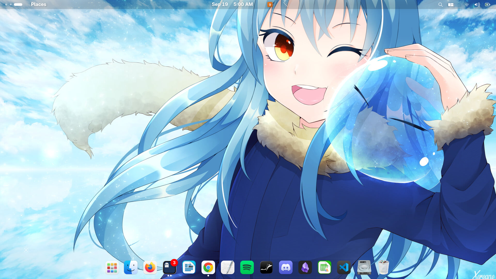

# rudystyle-dotfiles

My personal GNOME desktop setup on **Fedora Workstation 43** with **GNOME Shell 49**.
Everything needed to reproduce this look and feel on a fresh machine is collected here,
so switching devices does not mean starting from scratch.



## What this is

A backup-as-code of my desktop:

- **GNOME Shell** dconf settings (theme, fonts, workspaces, keybindings, Night Light, etc.)
- **GNOME Shell extensions** (user extensions are vendored, the rest are installed automatically)
- **WhiteSur** GTK theme, icon theme and cursors
- **JetBrainsMono Nerd Font**
- **Dash to Dock** + **Plank** dock configuration
- **GTK 3 / GTK 4** settings and CSS overrides
- **Ghostty** terminal theme ("Carbon Glass") and keybindings
- **Ptyxis** terminal profile (from dconf)
- **o-tiling**, **blur-my-shell**, **search-light** and other extension configs
- Wallpapers (the current one is set as the desktop background on install)
- Shell dotfiles: `.bashrc`, `.bash_profile`, fish completions
- `.gitconfig`

## Requirements

- Fedora Workstation (tested on 43) or another GNOME 49 based distro
- A Wayland or X11 GNOME session
- An internet connection (for themes, icons, cursors and fonts)

## Install

```bash
git clone git@github.com:ruddypp/rudystyle-dotfiles.git
cd rudystyle-dotfiles
./install.sh
```

Then **log out and log back in** so GNOME Shell reloads the theme and extensions.

### Options

| Flag            | Description                                             |
| --------------- | ------------------------------------------------------- |
| `--link`        | Symlink configs to this repo instead of copying them    |
| `--no-packages` | Skip `dnf` package installation                         |
| `--no-assets`   | Skip themes, icons, cursors and fonts                   |

The installer never deletes anything silently: existing files are copied to
`~/.rudystyle-dotfiles-backup-<timestamp>` first.

### Update

With `--link` the repo is the live source, so `git pull` alone updates everything.
With the default copy mode, re-run `./install.sh` after pulling.

## Layout

```
.
├── assets/                 # README images
├── config/                 # ~/.config subset
│   ├── autostart/
│   ├── environment.d/
│   ├── ghostty/
│   ├── gtk-3.0/
│   ├── gtk-4.0/
│   ├── nautilus/
│   ├── o-tiling/
│   └── plank/
├── gnome/
│   ├── dconf/              # dconf dumps (gnome.dconf, blackbox.dconf)
│   ├── extensions/         # user extensions (vendored)
│   ├── extensions.list     # extensions to enable after install
│   ├── extensions-remote.txt
│   └── packages.txt        # dnf packages
├── git/                    # .gitconfig
├── shell/                  # bash + fish config
├── wallpapers/             # background images
├── install.sh
└── uninstall.sh
```

## Highlights

- **Theme:** WhiteSur-Dark (GTK + Shell), WhiteSur icons, WhiteSur cursors (24px)
- **Fonts:** Adwaita Sans 11 for the UI, JetBrainsMono Nerd Font in terminals
- **Color scheme:** prefer-dark, blue accent, slight font hinting
- **Window buttons:** close / minimize / maximize on the **left**
- **Workspaces:** dynamic workspaces, switching with `Super+Page Up/Down` and `Ctrl+Alt+Left/Right`
- **Tiling:** `o-tiling` and `tiling-assistant` for keyboard-driven tiling
- **Terminal:** Ghostty `Carbon Glass` theme, 60% background opacity, `Ctrl+Shift+C/V` copy/paste, `Ctrl+N` new tab, `Alt+Tab` next tab

## Uninstall

```bash
./uninstall.sh
```

This removes the installed files, restores the newest backup, and leaves the
GNOME extensions for you to remove from Extension Manager if you want.

## Credits

Third-party assets installed by `install.sh`:

- [WhiteSur GTK Theme](https://github.com/vinceliuice/WhiteSur-gtk-theme) by vinceliuice
- [WhiteSur Icon Theme](https://github.com/vinceliuice/WhiteSur-icon-theme) by vinceliuice
- [WhiteSur Cursors](https://github.com/vinceliuice/WhiteSur-cursors) by vinceliuice
- [JetBrainsMono Nerd Font](https://github.com/ryanoasis/nerd-fonts) by ryanoasis

Wallpaper credit goes to the original artist. It is included here for personal use only.

## License

MIT for the configuration and scripts. Third-party themes, icons and fonts keep
their own licenses.
